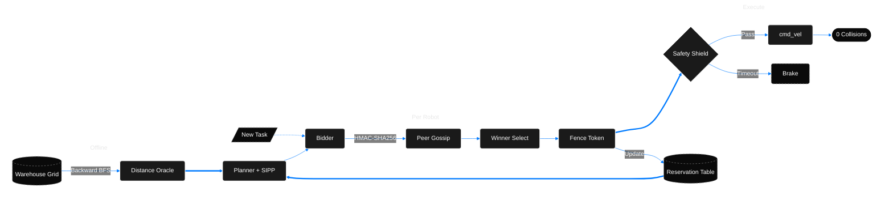
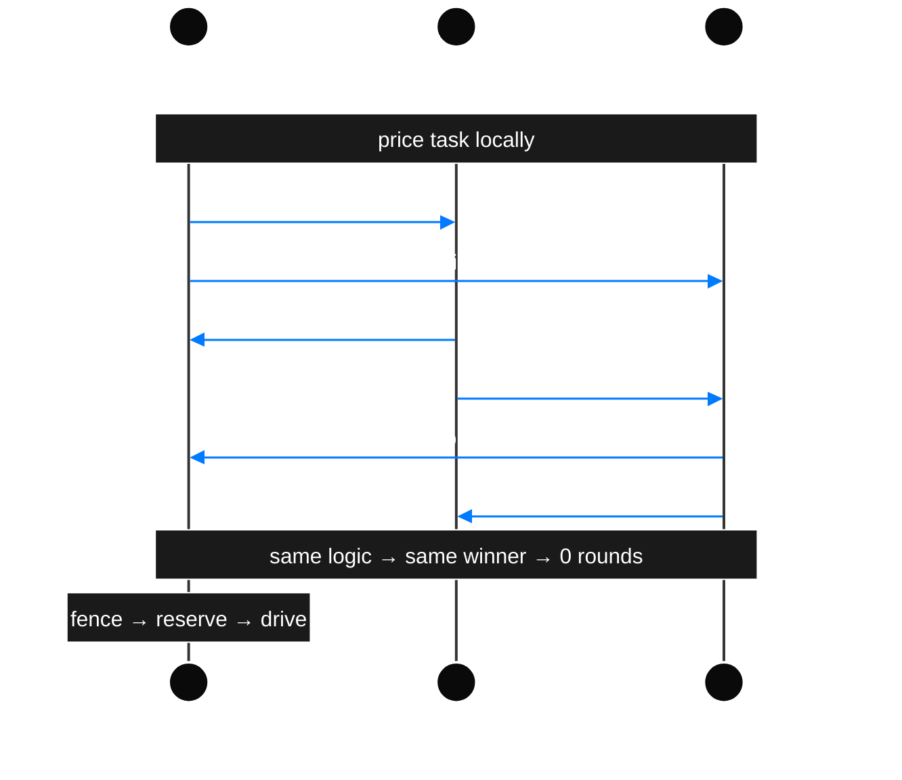

## **SIH26123** -- Edge-AI Based Distributed Fleet Coordination for Autonomous Mobile Robots (AMRs) in Smart Warehouses

### architecture

 

### consensus protocol

---

### how it works

#### bidding

each robot scores a task independently:

$$\text{score} = 0.45 \cdot \eta_{\text{eta}} + 0.20 \cdot C_{\text{congestion}} + 0.20 \cdot B_{\text{battery}} + 0.15 \cdot D_{\text{deadline}}$$

battery penalty uses a logistic sigmoid -- above 25% charge it's basically zero, below reserve it spikes to 1.0 and the robot routes itself to a charging dock instead:

$$B = \frac{1}{1 + \exp\!\big(15 \cdot (\text{SoC}_{\text{predicted}} - \text{SoC}_{\text{reserve}})\big)}$$

#### path planning (SIPP)

standard time-expanded A* creates a state for every `(cell, tick)` -- explodes when robots wait. SIPP collapses time into maximal safe intervals $[t_{\min}, t_{\max}]$, so search scales with obstacles not time horizon. keeps planning under 2ms even on a 2,337-cell grid.

#### collision avoidance

robots aren't points. swept-volume closest-point-of-approach catches clips during turns at sub-tick resolution:

$$u^* = \text{clamp}\!\left(-\frac{\mathbf{x} \cdot \mathbf{v}}{\|\mathbf{v}\|^2},\; 0,\; 1\right), \quad D_{\min}^2 = \|\mathbf{x} + u^* \mathbf{v}\|^2 \;\ge\; R_{\text{clearance}}^2$$

any trajectory violating clearance gets rejected before motors spin.

#### consensus

all robots broadcast HMAC-SHA256 signed bids via peer gossip. every robot runs the same deterministic reduction: lowest score wins, with a 5% fairness window that picks the least-worked robot among ties. identical inputs + identical logic = same winner everywhere, zero extra network rounds.

winner gets a 128-bit monotonic fence token, claims the reservation table, and commits its SIPP path.

#### safety shield

onboard C++ controller at 30 Hz on ROS 2 Jazzy. wheels only spin if: fresh odometry (< 0.50s), clear LiDAR (< 0.35s), live peer quorum lease (< 0.75s), and no fleet e-stop. wi-fi drops for > 750ms → authority lease expires → controlled deceleration to standstill.

---

### benchmarks

> 12 AMRs · 20 tasks · 273 cells · 3 choke points · seed `20260904`
> 
> 1 cell = 1.5m × 1.5m (standard pallet footprint) · 1 tick = 5.0s (loaded kinodynamic traverse)

| | stop-and-wait | kinesis | delta |
|:---|:---:|:---:|:---:|
| **makespan** | 476 ticks (39.7 min) | **69 ticks (5.8 min)** | **−85.5%** |
| **mean flow time** | 245 ticks (20.4 min) | **28.7 ticks (2.4 min)** | **−88.3%** |
| **throughput** | 30 orders/hr | **209 orders/hr** | **+590%** |
| **deadlines met** | 35% (7/20) | **100% (20/20)** | -- |
| **battery consumed** | 0.595 kWh | **0.163 kWh** | **−72.6%** |
| **collisions** | 0 | **0** | -- |

 

> validated across 30 randomized layouts with 10k bootstrap resamples:
> mean flow reduction **69.9%** · 95% CI **[68.4%, 71.4%]** · σ = 4.4% · 30/30 trials exceed the ≥20% SIH mandate

 

| stage | p50 | p95 | p99 |
|:---|:---:|:---:|:---:|
| **bid pricing (SIPP)** | 0.53 ms | 0.84 ms | 0.95 ms |
| **large grid SIPP (2337 cells)** | 1.25 ms | 2.09 ms | 2.35 ms |
| **fleet lookahead (12 AMRs)** | 29 ms | 30 ms | 31 ms |
| **quorum recovery (MTTR)** | 31 ms | 34 ms | -- |

bid pricing stays flat at ~1.8 ms p50 whether you run 12 or 100 robots -- each AMR prices independently against the reservation table, so it's $O(1)$ per robot.

 

#### at warehouse scale

evaluation on a 56,600 sq ft regional distribution center (`fulfillment-large-12`, 57×41 grid, 2,337 cells, 41.5% rack density):

| metric | stop-and-wait | kinesis | technical gain |
|:---|:---:|:---:|:---:|
| **order completion rate** | 18.8% (6/32) | **93.8% (30/32)** | **+75.0 pp** |
| **sustained throughput** | 12.7 orders/hr | **63.4 orders/hr** | **+400.0%** |
| **mean flow time** | 204.5 ticks (17.0 min) | **133.0 ticks (11.1 min)** | **-58.4%** |
| **fleet utilization** | 8.2% | **50.0%** | **6.1x active duty** |
| **choke-point deadlocks** | 26 task timeouts | **0 (825 reroutes resolved)** | **zero standoffs** |
| **100-AMR bid pricing** | central queue bottleneck | **1.84 ms p50** | **$O(1)$ invariant** |
| **100-AMR collisions** | gridlock | **0 conflicts** | **zero clashes** |

---
